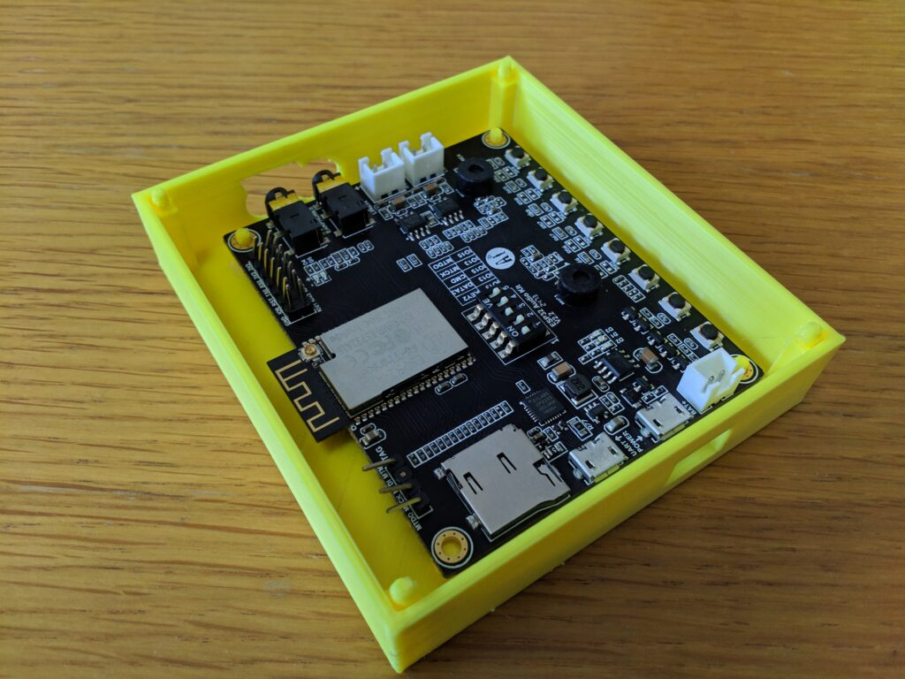
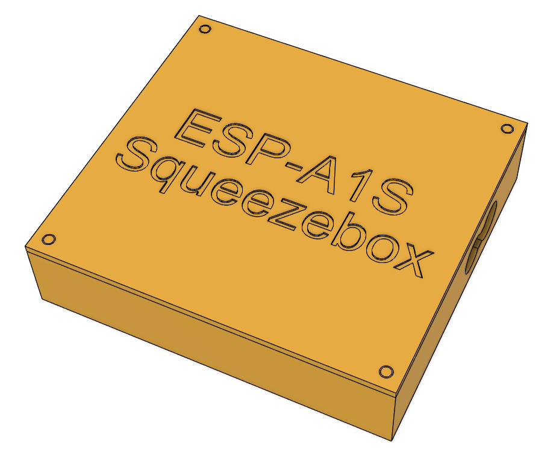
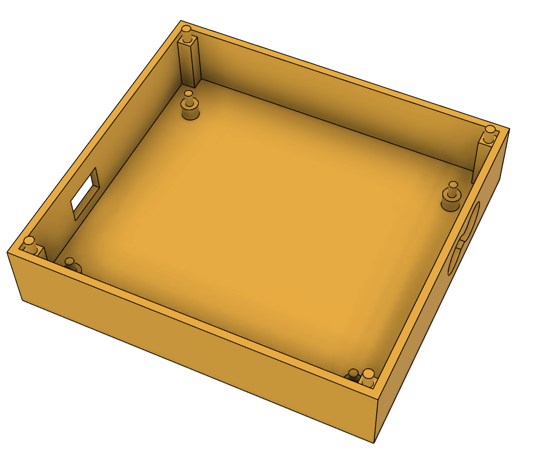
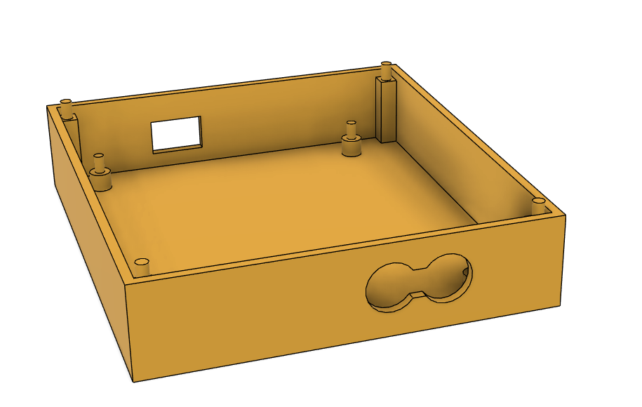

# ESP32-A1S Squeezebox Case
This repo contains the source for the 3D printed ESP32-A1S Squeezebox Case that I designed in Fusion 360. See the SourceFiles folder for several different 3D formats files.

